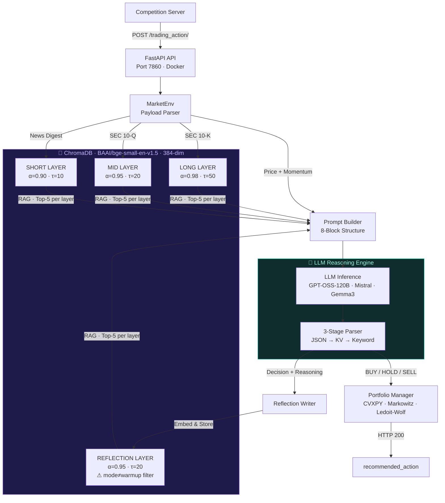
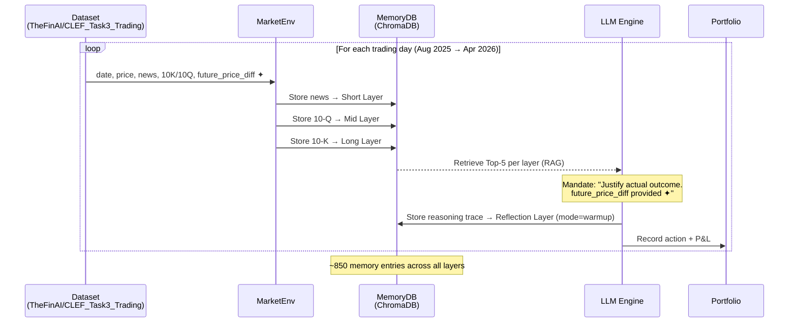
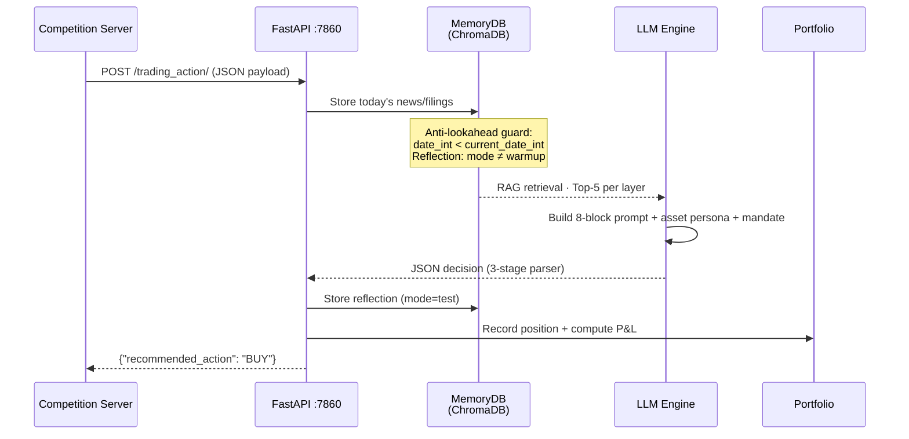

<div align="center">


# EdgeQuant Agent

### Autonomous LLM-Driven Financial Decision Intelligence

*A cognitive, memory-augmented trading agent that fuses real-time financial news,  
SEC filings, price dynamics, and large language model reasoning into daily BUY / HOLD / SELL decisions.*

---

[](https://www.python.org/)
[](https://fastapi.tiangolo.com/)
[](https://www.trychroma.com/)
[](https://www.docker.com/)
[](https://www.cvxpy.org/)
[](https://huggingface.co/)
[](https://clef2026.clef-initiative.eu/)
[](./LICENSE)

---

| Metric | Value | vs. Benchmark |
|:---|:---:|:---:|
| 📈 Portfolio Sharpe Ratio | **3.165** | +32.6% over equal-weight |
| 💰 TSLA Cumulative Return | **40.61%** | SR = 5.152 |
| 📉 Max Drawdown | **8.22%** | vs. 11.75% benchmark |
| 📊 Ann. Volatility | **26.6%** | vs. 38.2% benchmark |
| 🧠 Memory Layers | **4** | Short · Mid · Long · Reflection |
| ⚡ Inference Timeout | **< 3 min** | CLEF competition compliant |

</div>

---

## 📋 Table of Contents

- [Project Overview](#-project-overview)
- [Key Features](#-key-features)
- [System Architecture](#-system-architecture)
- [Workflow Pipeline](#-workflow-pipeline)
- [Tech Stack](#-tech-stack)
- [Project Structure](#-project-structure)
- [Installation & Setup](#-installation--setup)
- [Docker Deployment](#-docker-deployment)
- [Configuration](#-configuration)
- [API Documentation](#-api-documentation)
- [AI/ML Components](#-aiml-components)
- [Memory System Deep Dive](#-memory-system-deep-dive)
- [Portfolio Management](#-portfolio-management)
- [Backtesting & Evaluation](#-backtesting--evaluation)
- [Research Scope](#-research-scope)
- [Future Enhancements](#-future-enhancements)
- [Contributing](#-contributing)
- [Acknowledgements](#-acknowledgements)
- [License](#-license)

---

## 🧠 Project Overview

**EdgeQuant Agent** is a production-grade autonomous trading system designed for the [FinMMEval 2026 Task 3](https://clef2026.clef-initiative.eu/) benchmark at CLEF 2026. It solves a fundamental challenge in LLM-based financial agents: **temporal amnesia** (inability to consolidate knowledge across sessions) and **HOLD bias** (risk-averse neutrality under uncertainty).

The agent fuses four streams of financial intelligence — real-time news, SEC quarterly filings, SEC annual filings, and its own past decisions — into a persistent ChromaDB vector store. At each trading day, it performs semantic retrieval across all four layers, injects asset-specialised expert personas, and fires a structured prompt to an LLM to generate a daily **BUY / HOLD / SELL** decision for **BTC** and **TSLA**.

```
Competition Server → POST /trading_action/ → EdgeQuant Agent → {"recommended_action": "BUY"}
```

> **Research Paper:** Submitted to [CLEF 2026 Working Notes](https://ceur-ws.org/) (FinMMEval Lab, Task 3)  
> **Dataset:** [`TheFinAI/CLEF_Task3_Trading`](https://huggingface.co/datasets/TheFinAI/CLEF_Task3_Trading) via HuggingFace

---

## ✨ Key Features

<table>
<tr>
<td width="50%">

**🧠 Cognitive Memory Architecture**
- 4-tier vector memory: Short / Mid / Long / Reflection
- Persistent ChromaDB with BAAI/bge-small-en-v1.5 embeddings (384-dim)
- Compound scoring: semantic similarity + importance decay + recency
- Anti-lookahead guards for clean train-test separation

**🎯 Conviction-Forcing Mandate System**
- Eliminates HOLD bias on active market sessions
- Asset-adaptive rules: BTC 24/7 directional, TSLA weekday directional
- Calendar-aware mandate switching (weekday vs. weekend)
- Explainable decision traces logged per trade

</td>
<td width="50%">

**👤 Asset-Specialised Expert Personas**
- BTC: *Head of Digital Assets — ETF flows, liquidity clusters*
- TSLA: *Senior Equity Analyst — delivery variance, FSD monetisation*
- Zero fine-tuning required; persona injection at inference time
- Per-asset 8-block hierarchical prompt construction

**📊 Quantitative Portfolio Engine**
- Markowitz mean-variance optimisation via CVXPY
- Ledoit-Wolf shrinkage covariance estimation (β = 0.1)
- Per-asset isolated P&L tracking (BTC + TSLA)
- Full metrics: Sharpe Ratio, CR, MDD, AV, DV

</td>
</tr>
<tr>
<td>

**🔄 Two-Phase Lifecycle**
- **Warmup**: Oracle-guided supervised trace construction (~270 days)
- **Test**: Live inference with strict anti-leakage filters
- Mode-tag sanitisation on reflection queries
- Full checkpoint resumability at any trading step

</td>
<td>

**🚀 Production-Ready Deployment**
- FastAPI microservice on port 7860
- Docker containerised with full dependency isolation
- Ollama & OpenAI-compatible API support
- Local GPU inference with 4-bit quantisation (bitsandbytes)

</td>
</tr>
</table>

---

## 🏗️ System Architecture



---

## 🔄 Workflow Pipeline

### Phase 1 — Warmup (Supervised Trace Construction)



> ✦ `future_price_diff` is the oracle next-day return — available **only** in warmup phase.

### Phase 2 — Test (Live Inference)



---

## 🛠️ Tech Stack

| Category | Technology | Purpose |
|:---|:---|:---|
| **API Framework** | FastAPI 0.111 | Competition endpoint + request handling |
| **Vector Store** | ChromaDB (PersistentClient) | 4-layer semantic memory storage |
| **Embeddings** | BAAI/bge-small-en-v1.5 | 384-dim sentence embeddings for RAG |
| **LLM (Cloud)** | GPT-OSS-120B, Mistral-Large-675B, Gemma3-27B | Primary reasoning backbone |
| **LLM (Local)** | Ollama + HuggingFace Transformers | Offline inference fallback |
| **Quantisation** | bitsandbytes | 4-bit local model inference |
| **Portfolio Opt.** | CVXPY | Markowitz mean-variance optimisation |
| **Covariance** | Ledoit-Wolf Shrinkage | Regularised covariance estimation |
| **Data** | HuggingFace datasets | TheFinAI/CLEF_Task3_Trading loading |
| **Containerisation** | Docker | Reproducible deployment |
| **Serialisation** | orjson | High-performance JSON processing |
| **HTTP Client** | httpx | Async LLM API calls |

---

## 📁 Project Structure

```
EdgeQuant-Agent/
│
├── 📄 run.py                        # CLI entrypoint: warmup | test | eval
├── 📄 app.py                        # FastAPI application factory
├── 📄 competition_api.py            # Competition endpoint /trading_action/
├── 📄 Dockerfile                    # Container build definition
├── 📄 requirements.txt              # Python dependencies
│
├── 📂 configs/
│   └── main.json                    # Central hyperparameter configuration
│
├── 📂 data/
│   ├── btc.json                     # Processed BTC daily records
│   ├── tsla.json                    # Processed TSLA daily records
│   └── create_dataset.py            # HuggingFace → JSON pipeline
│
├── 📂 src/
│   ├── agent.py                     # Core agent: warmup + test + step logic
│   ├── market_env.py                # Payload parser + trading environment
│   ├── memory_db.py                 # ChromaDB 4-layer memory manager
│   ├── embedding.py                 # BAAI/bge embedding wrapper
│   ├── portfolio.py                 # Per-asset position + P&L tracker
│   ├── portfolio_tools.py           # CVXPY Markowitz + Ledoit-Wolf optimiser
│   ├── eval_pipeline.py             # Sharpe / CR / MDD / AV computation
│   │
│   └── 📂 chat/
│       ├── __init__.py              # Unified LLM interface
│       │
│       ├── 📂 endpoint/
│       │   └── ollama.py            # OllamaChatEndpoint (Ollama + OpenAI-compat.)
│       │
│       ├── 📂 prompt/
│       │   └── vllm_prompt.py       # 8-block prompt builder + persona injection
│       │
│       └── 📂 structure_generation/
│           └── schemas.py           # Pydantic output schemas + parser
│
└── 📂 checkpoints/
    └── warmup/
        └── chroma/                  # Persisted ChromaDB vector store
```

---

## ⚡ Installation & Setup

### Prerequisites

| Requirement | Version |
|:---|:---|
| Python | ≥ 3.10 |
| CUDA (optional) | ≥ 11.8 (for local LLM inference) |
| Docker (optional) | ≥ 24.0 |
| Ollama (optional) | Latest |

### 1. Clone the Repository

```bash
git clone https://github.com/<your-org>/EdgeQuant-Agent.git
cd EdgeQuant-Agent
```

### 2. Create Virtual Environment

```bash
python -m venv .venv
source .venv/bin/activate        # Linux / macOS
.venv\Scripts\activate           # Windows
```

### 3. Install Dependencies

```bash
pip install -r requirements.txt
```

### 4. Download and Prepare Dataset

```bash
python data/create_dataset.py
```

> This fetches `TheFinAI/CLEF_Task3_Trading` from HuggingFace and converts it to `data/btc.json` and `data/tsla.json`.

### 5. Configure the Agent

Edit `configs/main.json` (see [Configuration](#-configuration)).

### 6. Run Warmup Phase

```bash
python run.py warmup
```

> Processes ~270 historical trading days, building the ChromaDB memory store at `checkpoints/warmup/chroma/`.

### 7. Run Test / Live Inference

```bash
python run.py test
```

### 8. Run Evaluation

```bash
python run.py eval
```

---

## 🐳 Docker Deployment

### Build the Image

```bash
docker build -t edgequant-agent:latest .
```

### Run the Competition Endpoint

```bash
docker run -d \
  --name edgequant \
  -p 7860:7860 \
  -v $(pwd)/checkpoints:/app/checkpoints \
  -v $(pwd)/data:/app/data \
  edgequant-agent:latest
```

### Verify the Endpoint is Live

```bash
curl -X POST http://localhost:7860/trading_action/ \
  -H "Content-Type: application/json" \
  -d '{
    "date": "2026-05-15",
    "symbol": ["TSLA"],
    "price": {"TSLA": 175.0},
    "news": {"TSLA": ["Tesla Q1 deliveries beat analyst estimates by 12%"]},
    "momentum": {"TSLA": "bullish"},
    "10k": null,
    "10q": null,
    "history_price": {"TSLA": [
      {"date": "2026-05-12", "price": 173.50},
      {"date": "2026-05-13", "price": 174.20},
      {"date": "2026-05-14", "price": 175.00}
    ]}
  }'
```

**Expected response:**

```json
{
  "recommended_action": "BUY"
}
```

---

## ⚙️ Configuration

All hyperparameters are centralised in `configs/main.json`:

```json
{
  "symbols":          ["BTC", "TSLA"],
  "llm_temperature":  0.2,
  "max_new_tokens":   2048,
  "request_timeout":  300,
  "top_k_memory":     5,
  "momentum_window":  3,
  "history_window":   10,
  "initial_capital":  100000,
  "portfolio_lookback": 3,
  "embedding_model":  "BAAI/bge-small-en-v1.5",
  "embedding_dim":    384,
  "shrinkage_beta":   0.1,
  "memory_layers": {
    "short":      {"decay": 0.90, "recency_tau": 10,  "init_importance": 1.0},
    "mid":        {"decay": 0.95, "recency_tau": 20,  "init_importance": 2.0},
    "long":       {"decay": 0.98, "recency_tau": 50,  "init_importance": 3.0},
    "reflection": {"decay": 0.95, "recency_tau": 20,  "init_importance": 2.0}
  },
  "importance_cap":   10.0,
  "api_port":         7860
}
```

| Parameter | Default | Description |
|:---|:---:|:---|
| `llm_temperature` | `0.2` | Low stochasticity for consistent reasoning |
| `top_k_memory` | `5` | Retrieved memories per layer per query |
| `momentum_window` | `3` | Days for cumulative momentum signal |
| `shrinkage_beta` | `0.1` | Ledoit-Wolf covariance regularisation |
| `importance_cap` | `10.0` | Maximum memory importance score |

---

## 📡 API Documentation

### `POST /trading_action/`

The primary competition endpoint. Accepts a daily market payload and returns a trading action.

**Request Schema**

```json
{
  "date":          "2026-05-15",
  "symbol":        ["TSLA"],
  "price":         {"TSLA": 175.0},
  "news":          {"TSLA": ["...news summary..."]},
  "momentum":      {"TSLA": "bullish"},
  "10k":           {"TSLA": ["[SEC 10-K Filing]..."]} ,
  "10q":           {"TSLA": ["[SEC 10-Q Filing]..."]} ,
  "history_price": {
    "TSLA": [
      {"date": "2026-05-12", "price": 173.50},
      {"date": "2026-05-13", "price": 174.20},
      {"date": "2026-05-14", "price": 175.00}
    ]
  }
}
```

**Response Schema**

```json
{
  "recommended_action": "BUY"
}
```

| Field | Type | Values |
|:---|:---|:---|
| `recommended_action` | `string` | `"BUY"` \| `"HOLD"` \| `"SELL"` |

**Behaviour on Failure**

Any exception, timeout, or unparseable LLM output defaults to `HOLD`, consistent with CLEF 2026 competition rules.

---

## 🤖 AI/ML Components

### LLM Backends

EdgeQuant supports multiple LLM backends via a unified `OllamaChatEndpoint` class:

| Model | Type | Notes |
|:---|:---|:---|
| `gpt-oss:120b-cloud` | Cloud API | ⭐ Primary — best Sharpe Ratio (3.165) |
| `mistral-large-3:675b-cloud` | Cloud API | Strong secondary (SR = 0.904) |
| `gemma3:27b-cloud` | Cloud API | Mid-tier (SR = 0.429) |
| `nemotron-3-super:cloud` | Cloud API | Underperforms (SR = −0.867) |
| Any Ollama model | Local | Offline inference |
| HuggingFace Transformers + 4-bit | Local GPU | bitsandbytes quantisation |

### Asset Expert Personas

```python
BTC_PERSONA = """
You are the Head of Digital Assets for a Global Macro Fund.
Focus on liquidity clusters, institutional ETF flows, and network resilience.
Capture Alpha from volatility; ignore retail noise.
"""

TSLA_PERSONA = """
You are a skeptical Senior Equity Analyst specializing in Tesla.
Focus on unit-delivery variance, margin compression, and FSD monetization.
Prioritize immediate execution and competitive threats over historical narratives.
"""
```

### 8-Block Prompt Structure

Each inference prompt is constructed as a hierarchical 8-block structure:

```
Block 1 │ Character Persona          → Asset-specialised expert role
Block 2 │ Date & Price Context       → Current price + 10-day history
Block 3 │ Short-Term Memory          → Top-5 RAG results (news)
Block 4 │ Mid-Term Memory            → Top-5 RAG results (10-Q filings)
Block 5 │ Long-Term Memory           → Top-5 RAG results (10-K filings)
Block 6 │ Reflection Memory          → Top-5 RAG results (past decisions)
Block 7 │ Momentum Signal            → 3-day cumulative price direction
Block 8 │ Conviction-Forcing Mandate → Asset-adaptive directional rule
```

### Conviction-Forcing Mandate System

```python
# BTC — 24/7 continuous market
BTC_MANDATE = "ALPHA CAPTURE: BTC requires directional bias. HOLD IS PROHIBITED. \
               You MUST choose: BUY/SELL."

# TSLA — Active weekday session
TSLA_WEEKDAY_MANDATE = "ALPHA CAPTURE: Weekday trading requires captured alpha. \
                        HOLD IS PROHIBITED. You MUST choose: BUY/SELL."

# TSLA — Reduced information on weekends
TSLA_WEEKEND_MANDATE = "ALPHA CAPTURE: HOLD permitted if catalysts are low-magnitude (<2)."
```

### 3-Stage Response Parser

```python
# Stage 1: JSON block extraction
match = re.search(r'\{.*?\}', response, re.DOTALL)

# Stage 2: Key-value pattern search
match = re.search(r'"investment_decision"\s*:\s*"(\w+)"', response)

# Stage 3: Last keyword scan (most permissive)
for keyword in ['buy', 'sell', 'hold']:
    if keyword in response.lower():
        decision = keyword.upper()

# Fallback
decision = "HOLD"
```

---

## 🧠 Memory System Deep Dive

### Architecture Overview

```
ChromaDB PersistentClient
│
├── Collection: edgequant_short_BTC       ← Daily news (BTC)
├── Collection: edgequant_short_TSLA      ← Daily news (TSLA)
├── Collection: edgequant_mid_BTC         ← SEC 10-Q (BTC)
├── Collection: edgequant_mid_TSLA        ← SEC 10-Q (TSLA)
├── Collection: edgequant_long_BTC        ← SEC 10-K (BTC)
├── Collection: edgequant_long_TSLA       ← SEC 10-K (TSLA)
├── Collection: edgequant_reflection_BTC  ← Agent decisions (BTC)
└── Collection: edgequant_reflection_TSLA ← Agent decisions (TSLA)
```

### Memory Record Schema

Each stored memory contains:

| Field | Type | Description |
|:---|:---|:---|
| `id` | `int` | Unique sequential integer ID |
| `symbol` | `str` | `"BTC"` or `"TSLA"` |
| `date` | `str` | ISO format date |
| `date_int` | `int` | `YYYYMMDD` integer for range filtering |
| `text` | `str` | Memory content (news / filing / reflection) |
| `layer` | `str` | `short` / `mid` / `long` / `reflection` |
| `mode` | `str` | `warmup` or `test` |
| `importance` | `float` | Accumulated importance score |

### Compound Scoring Formula

$$
s = s_{\text{sim}} + \frac{\min(s_{\text{imp}},\ U)}{U} + e^{-\Delta/\tau}
$$

| Component | Symbol | Description |
|:---|:---|:---|
| Semantic similarity | $s_{\text{sim}}$ | Cosine similarity via ChromaDB query |
| Importance score | $s_{\text{imp}}$ | Accumulated access importance, capped at $U=10$ |
| Recency score | $e^{-\Delta/\tau}$ | Exponential decay over $\Delta$ days |

### Anti-Lookahead Guards

```python
# Guard 1 — Date-limit filtering (ALL layers in TEST mode)
where_clause["$and"].append({
    "date_int": {"$lt": int(current_date.strftime("%Y%m%d"))}
})

# Guard 2 — Mode-tag sanitisation (Reflection layer only)
if run_mode == "test" and layer == "reflection":
    where_clause["$and"].append({
        "mode": {"$ne": "warmup"}
    })
```

---

## 📊 Portfolio Management

### Per-Asset Isolation

```
Initial Capital: $100,000
├── BTC Track:  $50,000 → asset_cash / asset_shares / asset_value[]
└── TSLA Track: $50,000 → asset_cash / asset_shares / asset_value[]
```

**Position mapping:**

| Action | Position | Description |
|:---|:---|:---|
| `BUY` | Long | Full allocation into asset |
| `HOLD` | Flat | No exposure, cash preserved |
| `SELL` | Short | Inverse position on asset |

### Markowitz Optimisation

```python
import cvxpy as cp

w = cp.Variable(n_assets)
risk = cp.quad_form(w, cov_matrix)            # wᵀΣw
objective = cp.Maximize(mean_returns.T @ w - risk)

# Ledoit-Wolf shrinkage: β=0.1
shrunk_cov = 0.1 * (mean_var * I) + 0.9 * sample_cov
```

### Evaluation Metrics

```python
# Sharpe Ratio (annualised)
SR = (mean_daily_return / std_daily_return) * sqrt(252)

# Cumulative Return
CR = (final_portfolio_value - initial_capital) / initial_capital

# Maximum Drawdown
MDD = max((peak - trough) / peak)  for all (peak, trough) pairs

# Annualised Volatility
AV = std_daily_return * sqrt(252)
```

---

## 📈 Backtesting & Evaluation

### Results Summary (January – April 2026)

**Portfolio Level**

| Model | Cum. Return | Sharpe Ratio | Max Drawdown | Ann. Volatility |
|:---|:---:|:---:|:---:|:---:|
| Equal-Weight Benchmark | 0.1886 | 2.387 | 0.1175 | 0.3816 |
| **GPT-OSS-120B** ⭐ | **0.1809** | **3.165** | **0.0822** | **0.2662** |
| Mistral-Large-675B | 0.0436 | 0.904 | 0.1160 | 0.2690 |
| Gemma3-27B | 0.0158 | 0.429 | 0.1012 | 0.2493 |
| Nemotron-Super | −0.0544 | −0.867 | 0.1348 | 0.2703 |

**Per-Asset (GPT-OSS-120B)**

| Asset | Cum. Return | Sharpe Ratio | Max Drawdown | Volatility |
|:---|:---:|:---:|:---:|:---:|
| **TSLA** | **0.4061** | **5.152** | **0.0949** | 0.3323 |
| BTC | −0.0444 | −0.374 | 0.1910 | 0.3871 |

### Running Evaluation

```bash
# Evaluate against the equal-weight benchmark
python run.py eval

# Outputs: Sharpe Ratio, CR, MDD, AV, DV for each asset + combined portfolio
```

---

## 🔬 Research Scope

EdgeQuant Agent was developed as part of a research submission to **CLEF 2026 FinMMEval Task 3**. The working notes paper covers:

- Four-tier cognitive memory architecture with compound scoring
- Anti-lookahead bias prevention mechanisms
- Asset-specialised LLM persona injection
- Conviction-forcing mandate system design
- Comprehensive ablation across 4 LLM backends
- TSLA vs. BTC alpha source decomposition

**Citation**

```bibtex
@inproceedings{EdgeQuantAgent2026,
  title     = {EdgeQuant Agent: A Tiered Cognitive Memory Architecture for
               LLM-Driven Financial Decision Making at FinMMEval 2026 Task 3},
  booktitle = {CLEF 2026 Working Notes},
  series    = {CEUR Workshop Proceedings},
  year      = {2026},
  address   = {Jena, Germany},
  publisher = {CEUR-WS.org},
}
```

**Related Work**

| Reference | Relevance |
|:---|:---|
| [Park et al., 2023 — Generative Agents](https://arxiv.org/abs/2304.03442) | Tiered memory & reflection design |
| [Shinn et al., 2023 — Reflexion](https://arxiv.org/abs/2303.11366) | Verbal reinforcement via self-reflection |
| [Lewis et al., 2020 — RAG](https://arxiv.org/abs/2005.11401) | Retrieval-augmented generation framework |
| [Markowitz, 1952 — Portfolio Selection](https://www.jstor.org/stable/2975974) | Mean-variance optimisation |
| [Ledoit & Wolf, 2004 — Shrinkage](https://www.sciencedirect.com/science/article/pii/S0047259X03000964) | Regularised covariance estimation |

---

## 🚀 Future Enhancements

| Priority | Enhancement | Rationale |
|:---|:---|:---|
| 🔴 High | **Conditional HOLD for BTC** | HOLD prohibition backfires during sustained downtrends; add 20-day momentum gate |
| 🔴 High | **Memory importance feedback loop** | Reinforce correct-prediction memories; penalise wrong-prediction ones post-trade |
| 🟡 Medium | **Extended technical signals** | RSI, MACD, Bollinger Bands, 20-day momentum window as structured prompt features |
| 🟡 Medium | **Multi-model ensemble voting** | Majority vote across GPT / Mistral / Gemma for robustness against single-model failures |
| 🟡 Medium | **Memory ablation framework** | Isolate each memory tier's individual Sharpe Ratio contribution via systematic ablation |
| 🟢 Low | **Portfolio optimiser integration** | Connect CVXPY weights fully to fractional position sizing instead of binary long/flat/short |
| 🟢 Low | **Multilingual news support** | Extend to non-English financial news via NLLB-200 translation layer |

---

## 🤝 Contributing

Contributions are welcome from AI engineers, quant developers, and open-source researchers.

### Contribution Workflow

```bash
# 1. Fork the repository
# 2. Create a feature branch
git checkout -b feature/your-feature-name

# 3. Make your changes with clear commits
git commit -m "feat: add conditional HOLD gate for BTC based on 20-day momentum"

# 4. Push and open a Pull Request
git push origin feature/your-feature-name
```

### Contribution Areas

- 🧠 **Memory System** — Improved scoring formulas, new memory layers
- 🤖 **LLM Integration** — New model backends, better prompt engineering
- 📊 **Portfolio** — Risk management improvements, position sizing strategies
- 📡 **Data Pipeline** — Additional asset support, real-time data feeds
- 📝 **Documentation** — Tutorials, notebooks, architecture diagrams
- 🧪 **Testing** — Unit tests, integration tests, backtesting frameworks

---

## 🙏 Acknowledgements

- **FinMMEval 2026 Organisers** — For the competition infrastructure, dataset, and Agent Market Arena evaluation platform
- **TheFinAI Team** — For the [`CLEF_Task3_Trading`](https://huggingface.co/datasets/TheFinAI/CLEF_Task3_Trading) dataset
- **MBZUAI** — For hosting the [`finmmeval-lab-clef2026`](https://huggingface.co/MBZUAI/finmmeval-lab-clef2026) collection
- **ChromaDB** — For the open-source vector store powering the memory system
- **CVXPY** — For the convex optimisation framework
- **Hugging Face** — For the sentence-transformers and datasets ecosystem
- **FastAPI** — For the high-performance API framework

---

## 📄 License

```
MIT License

Copyright (c) 2026 EdgeQuant Agent Contributors

Permission is hereby granted, free of charge, to any person obtaining a copy
of this software and associated documentation files (the "Software"), to deal
in the Software without restriction, including without limitation the rights
to use, copy, modify, merge, publish, distribute, sublicense, and/or sell
copies of the Software...
```

See [`LICENSE`](./LICENSE) for the full text.

---

<div align="center">

**Built for CLEF 2026 · FinMMEval Lab · Task 3: Financial Decision Making**

*Tiered memory. Expert reasoning. Conviction-driven decisions.*

---

⭐ **Star this repository** if EdgeQuant Agent helps your research or trading systems.

</div>
